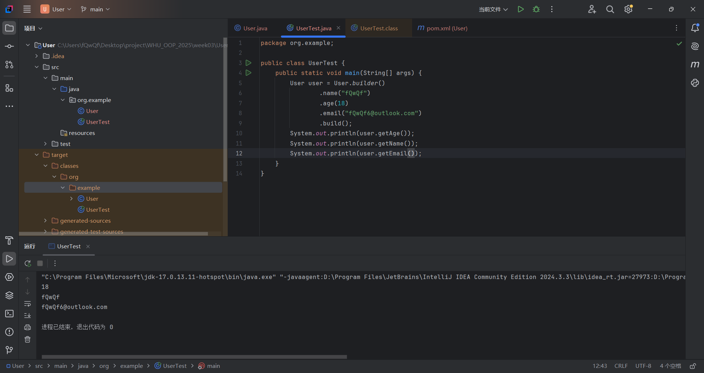
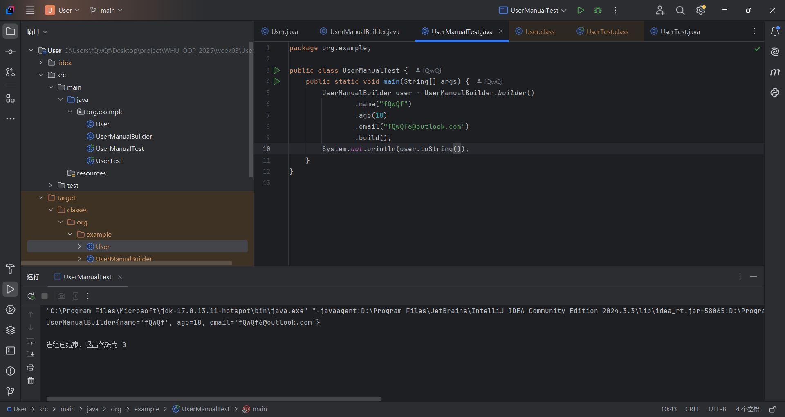
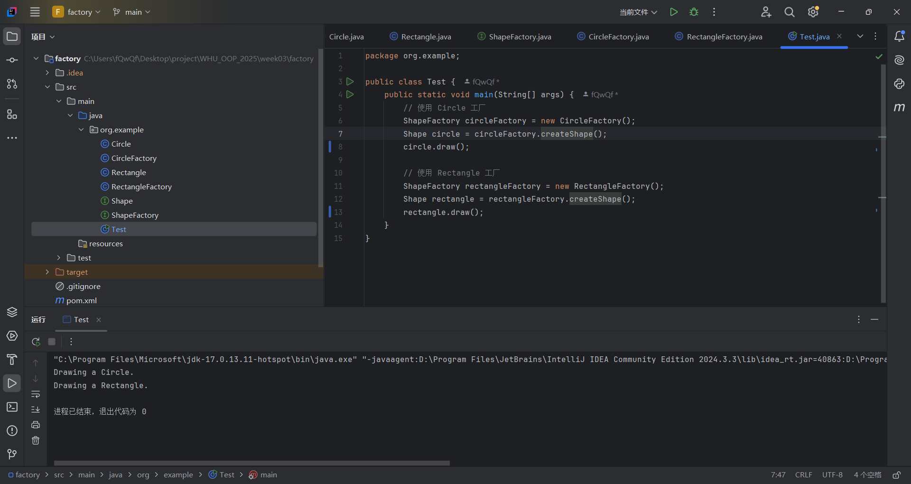

# week03

## Lombok Builder

- 使用Lombok的@Builder注解实现的[代码文件](./User/src/main/java/org/example/User.java)。
- 自己编写的Builder实现[代码文件](./User/src/main/java/org/example/UserManualBuilder.java)。
- [反汇编](./User/user_decompilation.java)分析报告，展示手动实现的Builder与Lombok自动生成的代码对比。

## 创建型设计模式

- 创建型设计模式（简单工厂或工厂方法）的[代码实现文件](./factory/src/main/java/org/example/Test.java)。

## 学习心得

在本次学习中，我系统掌握了Lombok的@Builder注解对复杂对象构建的优化机制。该注解通过自动化生成Builder类，有效消除了传统Builder模式中大量重复的setter方法和构建逻辑。其自动生成的链式调用接口和参数管理机制，显著提升了代码的编写效率。

我个人感觉Lombok的builder有点像bash的管道，通过一系列命令将输入的数据转换成输出的结果。当然我觉得Powerdhell的管道更加灵活，也更加类似于这里的实现，毕竟bash的设计实在是......不像正常人能想出来的。或者更准确地说类似于一些函数式编程的思想？毕竟Lombok的build过程更像是对于builder进行一系列函数处理，最后利用处理完的builder构建对象。

简单工厂模式的实践让我认识到其在对象创建解耦中的重要价值。该模式通过集中管理实例化过程，使客户端代码仅需通过工厂接口即可获取所需对象实例，从而实现了对象创建与使用逻辑的分离。这种设计在需要扩展新类型时表现出明显优势，但其静态方法特性导致新增类型时必须修改工厂类，存在违反开闭原则的局限性。相较而言，工厂方法模式通过抽象工厂接口的引入，能够更好地满足高扩展性场景的需求。这里我采用了工厂方法模式，通过抽象工厂接口定义了创建对象的接口，使得新增类型时无需修改工厂类，符合开闭原则。

设计模式和Lombok都是经过长期实践而产生的。既然可以稳定存在，那么就必有其可取之处。实际工程中还是应该广泛使用的，毕竟不要重复造轮子嘛。🤣
