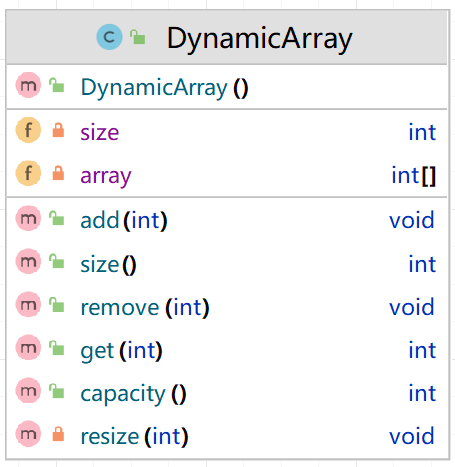

# week04

## 实验内容

```java
// 创建DynamicArray实例
DynamicArray dynamicArray = new DynamicArray();

// 添加元素
dynamicArray.add(1);
dynamicArray.add(2);
dynamicArray.add(3);
System.out.println("After adding elements: ");
printDynamicArray(dynamicArray);

// 删除元素
dynamicArray.remove(1); // 删除索引为1的元素，即元素2
System.out.println("After removing element at index 1: ");
printDynamicArray(dynamicArray);

// 再次添加元素，观察动态扩容
dynamicArray.add(4);
dynamicArray.add(5);
System.out.println("After adding more elements: ");
printDynamicArray(dynamicArray);

// 获取并打印特定索引的元素
System.out.println("Element at index 2: " dynamicArray.get(2));

// 打印当前数组的大小和容量
System.out.println("Size: " dynamicArray.size());
System.out.println("Capacity: " dynamicArray.capacity());
```



实现一个支持动态扩容和收缩的数组类DynamicArray。并在main方法中执行下列操作，通过控制台的打印输出，观察各方法的执行情况和数组的变化。

- 创建DynamicArray实例
- 添加元素
- 打印所有元素
- 删除元素
- 打印所有元素
- 再次添加元素，观察动态扩容
- 打印所有元素
- 获取并打印特定索引的元素
- 打印当前数组的大小和容量


## 实验目的
1. 动态数组的内部工作原理：了解如何在数组达到容量限制时自动增加容量，以及何时以及如何减少容量，可以提供对数据结构背后逻辑的深入理解。
2. 数组与内存管理：掌握数组如何在内存中分配和管理空间，以及动态调整数组大小时对内存的操作。
3. 编程基础和面向对象的实践：通过实现自定义数据结构，加深对面向对象编程概念的理解，如封装、抽象以及类的设计。

## 交付内容
提交代码截图和运行结果的截图。
